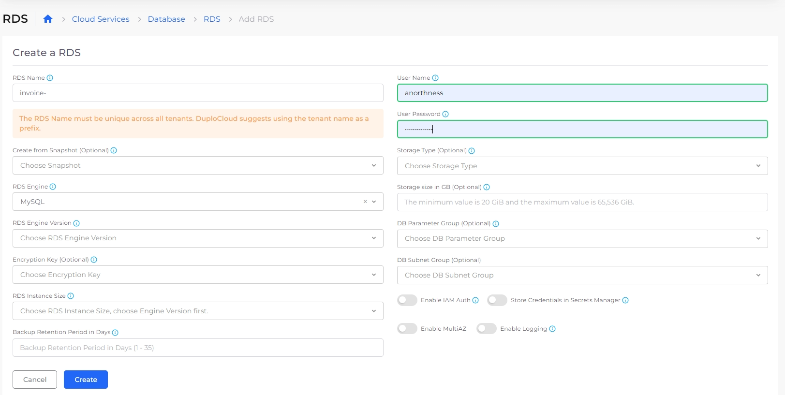

# RDS database


Support for the Aurora Serverless V1 database engines has been deprecated. When using Terraform, do not create V1 engines.


DuploCloud supports the following RDS databases in AWS:

* MySQL
* PostgreSQL
* MariaDB
* Microsoft SQL-Express
* Microsoft SQL-Web
* Microsoft SQL-Standard
* Aurora MySQL
* Aurora MySQL Serverless
* Aurora PostgreSQL
* Aurora PostgreSQL Serverless


When upgrading RDS versions, use AWS Console and see your Cloud Provider for compatibility requirements. Note that while versions 5.7.40, 5.7.41, and 5.7.42 cannot be upgraded to version 8.0.28, you can upgrade these versions to version 8.0.32 and higher.


## Creating an RDS database 

1. In the DuploCloud Portal, navigate to **Cloud Services** -> **Database**.
2. Click **Add**. The **Create a RDS** page displays.
3. Fill out the form based on your requirements, and **Enable Logging**, if needed.
4. Optionally, in the **Backup Retention Period in Days** field, enter a number of days to retain automated backups between one (**1**) and thirty-five (**35**). If a value is not entered, the Backup Retention Period value configured in Systems Settings will be applied.&#x20;

<figure><figcaption>
<strong>Create a RDS</strong> window
</figcaption></figure>

#### Create Aurora Serverless V2 Cluster database

You can create Aurora Serverless V2 Databases by selecting **Aurora-MySql-Serverless-V2** or **Aurora-PostgreSql-Serverless-V2** from the **RDS Database Engine** list box. Select the RDS Engine Version compatible with Aurora Serverless v2. The **RDS Instance Size** of `db.serverless` applies to both engines.

## Connecting to the database 

Once the database is created, select it and use the **Instances** tab to view the endpoint and credentials. Use the **Endpoints** and credentials to connect to the database from your application running in an EC2 instance. The database is only accessible from inside the EC2 instance in the current Tenant, including the containers running within.

<figure><figcaption>
<strong>RDS Instances</strong> tab
</figcaption></figure>


Pass the endpoint, name, and credentials to your application [using environment variables](../../containers/passing-config-and-secrets.md) for maximum security.&#x20;


