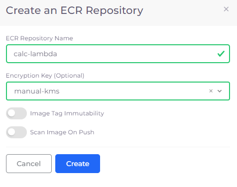

# Elastic Container Registry (ECR)

Amazon Elastic Container Registry (ECR) is a fully managed Docker container registry that allows users to easily store, manage, and deploy container images within AWS. ECR integrates seamlessly with Amazon ECS, EKS, and other AWS services to provide secure and scalable container image storage. Users can push, pull, and manage container images with built-in security features like encryption at rest and access control via AWS IAM.

## Creating an ECR Repository 

1. In the DuploCloud Portal, navigate to **Cloud Services** -> **Storage**.
2.  Click the **ECR Repository** tab. The **ECR Repository** page displays.\

    
<figure><figcaption>
The <strong>Create an ECR Repository</strong> pane
</figcaption></figure>

3. Click **Add**. The **Create an ECR Repository** page displays.
4. In the **ECR Repository Name** field, enter the ECR Repository Name.
5. Click **Create**.

## Uploading Container Images to an ECR Repository 

1. Login to ECR
2. Tag the images you have built.
3. Push the images to the ECR Repository that you created.

Refer to the [AWS Documentation](https://docs.aws.amazon.com/AmazonECR/latest/userguide/docker-push-ecr-image.html) for more details about uploading Container Images.

## Updating ECR Repository settings

1. Select the Tenant from the **Tenant** list box.
2. Navigate to **Cloud Services** -> **Storage** in the DuploCloud Portal.
3. Select the **ECR Repository** tab.
4. In the row of the ECR repository you want to delete, click the menu icon ().
5.  Select **Update Settings**. The **Update ECR Repository Settings** pane displays.\

    
<figure><figcaption>
The <strong>Update ECR Repository Settings</strong> pane
</figcaption></figure>

6. Enable or disable **Image Tag Immutability** and **Scan Image On Push** settings as needed.&#x20;
7. Click **Update**. The ECR settings are updated

## Deleting an ECR Repository

If you no longer need an ECR repository used for storing Lambda container images, you can delete it from DuploCloud.&#x20;

1. Select the Tenant from the **Tenant** list box.
2. Navigate to **Cloud Services** -> **Storage** in the DuploCloud Portal.
3. Select the **ECR Repository** tab.
4. In the row of the ECR repository you want to delete, click the menu icon ().
5. Select **Delete** or **Force Delete**:
   * **Delete**: If the repository contains any images, you will need to manually remove them before you can delete the repository.
   * **Force Delete**: This option immediately removes the repository and all of its contents (container images) without needing to empty the repository first.

<figure><figcaption>
The <strong>ECR Repository</strong> tab with the <strong>Delete</strong> and <strong>Force Delete</strong> menu options highlighted
</figcaption></figure>
