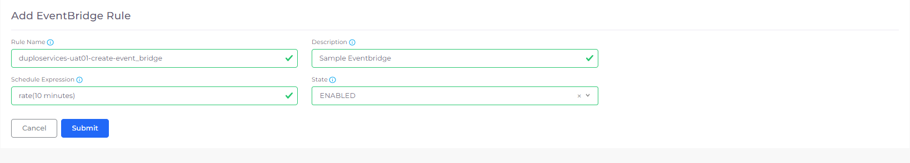
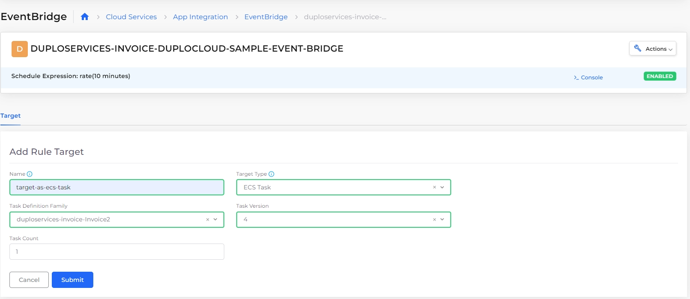

# EventBridge

Amazon EventBridge lets you easily ingest, filter, transform, and route events to build event-driven applications. DuploCloud simplifies this by allowing you to create routing rules that send data to the right targets, enabling real-time, automated responses across your applications.

## Adding EventBridge rules

1. In the DuploCloud Portal, navigate to **Cloud Services** -> **App Integration**.
2. Click the **EventBridge** tab.
3.  Click **Add**. The **Add EventBridge Rule** page displays.\

    <figure><figcaption>
<strong>Add EventBridge Rule</strong> page
</figcaption></figure>
4. In the **Rule Name** field, specify the rule name.
5. In the **Description** field, enter a rule description.
6. In the **Schedule Expression** field, enter the interval using **rate(x interval)** format, for example, **rate(5 minutes)**. Include a space between the number and the interval (seconds, minutes, hours, or days).
7. In the **State** list box, select whether the rule is **ENABLED** (active and running on schedule) or **DISABLED** (inactive and not triggered).
8. Click **Submit**. The rule is displayed in the **EventBridge** tab.

## Updating EventBridge rules

1. In the DuploCloud Portal, navigate to **Cloud Services** -> **App Integration**.
2. Click the **EventBridge** tab.
3. Select the menu (  ) icon in the **Actions** column for the rule you want to update, and click **Update**. The **Update EventBridge Rule page** displays.
4. Edit the EventBridge rule configurations as needed.
5. Click **Submit** to update the rule.

## Adding EventBridge targets

A  [target ](https://docs.aws.amazon.com/eventbridge/latest/userguide/eb-targets.html) is a resource where EventBridge sends an [event](https://docs.aws.amazon.com/eventbridge/latest/userguide/eb-events.html) that matches the pattern defined for a [rule](https://docs.aws.amazon.com/eventbridge/latest/userguide/eb-rules.html). Each rule can send events to up to five targets. In DuploCloud, you can choose **ECS Task** or **Lambda** as the target type, and DuploCloud automatically handles the permissions needed to let EventBridge send the event.

Complete the following steps to add an EventBridge target in DuploCloud.

1. In the DuploCloud Portal, navigate to **Cloud Services** -> **App Integration**.
2. Click the **EventBridge** tab. The defined rules are displayed.
3. Click the name of the EventBridge rule where you want to add a target.
4. In the **Target** tab, click **Add**. The **Add Rule Target** page displays.

<figure><figcaption>
<strong>Target</strong> tab for an EventBridge rule with <strong>Target Type ECS Task</strong>
</figcaption></figure>

5. In the **Name** field, enter a target name.
6. From the **Target Type** list box, select a target type.
7. From the **Task Definition Family** list box, select a task definition family.
8. In the **Task Version** field, enter a numeric version number.
9. Click **Submit**. The target displays on the **Target** tab.

<figure><figcaption>
<strong>Target</strong> tab for an EventBridge rule displaying targets for <strong>Target Type</strong> <strong>ECS Task</strong> and <strong>Lambda</strong>
</figcaption></figure>
