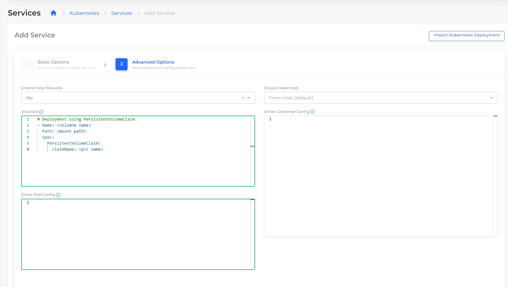

# Storage Class and PVCs

### **Step 1:** Create an Amazon EFS &#x20;

&#x20;Refer to steps [here](../../../aws-user-guide/aws-services/elastic-file-system-efs/)

### Step 2:  Create Storage Class with EFS Parameter

Navigate to  **Kubernetes** -> **Storage** -> **Storage Class**

Configure EFS parameter created at Step1 by clicking on EFS Parameter.

.png>)

### Step3: Create Persistent Volume (PVC) using Storage Class

Here, we are configuring Kubernetes to use Storage Class created in Step2 above, to create a Persistent Volume with 10Gi of storage capacity and ReadWriteMany access mode.

.png>)


### Step4:  Mount PVC to the POD Deployment

Configure below in **Volumes** to create your application deployment using this PVC.&#x20;


```
# Deployment using PersistentVolumeClaim. 
- Name: <volumne name>
  Path: <mount path>
  Spec:
    PersistentVolumeClaim:
      claimName: <pvc name>
```


<figure><figcaption><p>Services Page</p></figcaption></figure>
