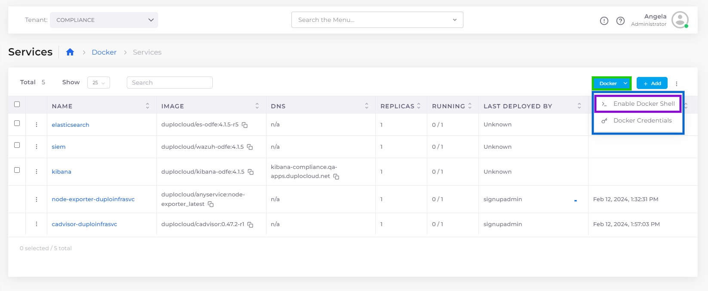
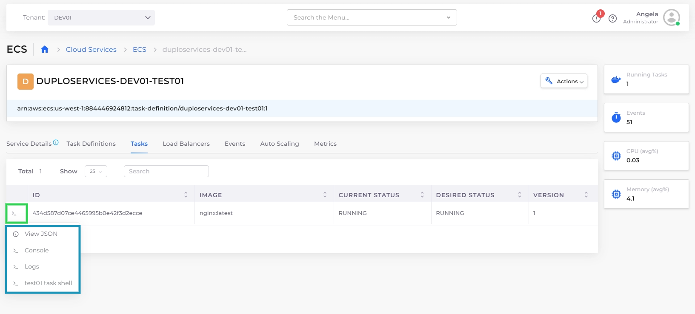

# Shell Access for Docker or ECS

DuploCloud allows shell access into the deployed containers. Shell access is enabled differently, depending on whether you use native Docker or ECS.

## Enabling Secure Shell (SSH) Access for Docker Containers

1. In the DuploCloud Portal, navigate to **Docker** -> **Services**.&#x20;
2. From the **Docker** list box, select **Enable Docker Shell**. The **Start Shell Service** pane displays.

<figure><figcaption>
The <strong>Enable Docker Shell</strong> option in the <strong>Options</strong> menu on the <strong>Services</strong> page
</figcaption></figure>

<figure><figcaption>
The <strong>Start Shell Service</strong> pane
</figcaption></figure>

3. From the **Certificate** list box, select your certificate.
4. From the **Visibility** list box, select **Public** or **Internal**.&#x20;
5. Click **Update**. A provisioned Service named **dockerservices-shell** is created, enabling you to access containers using SSH.

## Accessing the Task Shell for ECS

1. From the DuploCloud Portal, navigate to **Cloud Services** -> **ECS**. The **ECS** **Task Definition** page displays.
2. Select the name from the **TASK DEFINITION FAMILY NAME** column.
3. Select the **Tasks** tab.
4. To display the ECS task shell for any task, click on the **(>\_**) icon in the **Actions** column of the appropriate row. Click on the container task shell option. A browser launches, giving access to the shell.

<figure><figcaption>
The <strong>ECS task shell</strong> option in the menu of the <strong>Tasks</strong> tab
</figcaption></figure>

## Enabling a Kubernetes shell

1. In the **Tenant** list box, select the **Default** Tenant.
2. In the DuploCloud portal, navigate to **Docker** -> **Services**.
3. Click the **Docker** button on the upper right, and select **Enable Docker Shell**. The **Start Shell Service** pane displays.

<figure><figcaption>
The <strong>Start Shell Service</strong> pane
</figcaption></figure>

4. In the **Platform** list box, select **Kubernetes**.
5. Select the appropriate certificate from the **Certificate** list box.
6. In the **Visibility** list box, select **Public**.
7. Click **Update**. DuploCloud provisions the **dockerservices-shell** service, enabling you to access your Docker containers using the Kubernetes shell.

Once the service is provisioned, you can access the Kubernetes shell by navigating to **Kubernetes** -> **Services** in the DuploCloud portal and clicking the **KubeCtl Shell** button. This will launch the Kubernetes shell, allowing you to interact with your Docker containers running on the Kubernetes platform.
