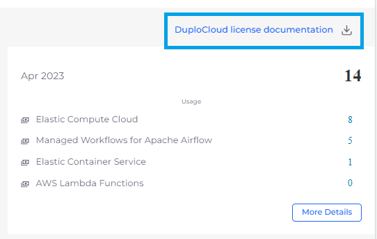

# DuploCloud License Usage

DuploCloud calculates license usage by Node for the following categories:

* Elastic Compute Cloud
* Elastic Container Services
* AWS Lambda Functions
* Managed Workflows for Apache Airflow

## Viewing Node Usage for Billing

1. In the DuploCloud portal, navigate to **Administrator** -> **Billing**. The **Billing** page displays.
2.  Click the **DuploCloud License Usage** tab.\

    
<figure><figcaption>
<strong>DuploCloud License Usage</strong> tab on the <strong>Billing</strong> page in the DuploCloud Portal
</figcaption></figure>

3. Click **More Details** in any **License Usage** card for additional breakdown of Node Usage statistics per Tenant.

<figure><figcaption>
The <strong>DuploCloud License Usage</strong> page showing <strong>More Details</strong>. 
</figcaption></figure>


Click the **DuploCloud license documentation** link to download a copy of the license document.


<figure><figcaption>
Month-view of Node Usage for billing with <strong>DuploCloud license documentation</strong> link highlighted
</figcaption></figure>

