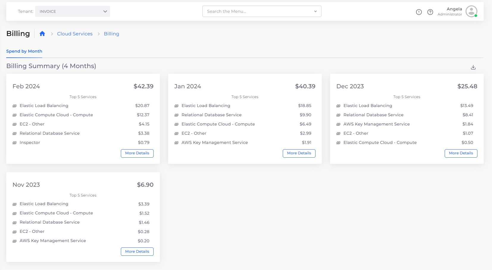

# Viewing and Monitoring AWS Billing Data

From the DuploCloud portal, administrators can view account spending details by month, week, and Tenant. Non-administrator users can view billing data for a Tenant they have user access to.

Discounts like [Compute Savings Plans](https://aws.amazon.com/savingsplans/compute-pricing/) are incorporated into the costs displayed on the dashboard. It shows what you will pay with the current discounts in place.

In addition, DuploCloud allows you to set up billing alerts to monitor your cloud spending.&#x20;

## Prerequisites

* Complete the steps on the [Enable billing data page](enable-billing-data.md) before attempting to view billing data in the portal.

## Viewing Account Billing Details

View the billing details for your company's AWS account.&#x20;

1. Log in as an administrator, and navigate to **Administrator** -> **Billing**. &#x20;

<figure><figcaption>
The <strong>Billing</strong> dashboard for AWS
</figcaption></figure>

You can view usage by:

* Time
  * Select the **Spend by Month** tab and click **More Details** to display monthly and weekly spending options. &#x20;
* Tenant
  * Select the **Spend by Tenant** tab.

<figure><figcaption>
<strong>Spend by Month</strong> tab with monthly and weekly options displayed
</figcaption></figure>

## Viewing Tenant Billing Details

View billing details for a selected Tenant. This option is accessible to non-administrator users with user access to the selected Tenant.&#x20;

1. Select the **Tenant** name from the **Tenant** list box.&#x20;
2. Navigate to **Cloud Services** -> **Billing**. The **Billing** page displays.

<figure><figcaption>
The <strong>Billing</strong> dashboard for the Invoice Tenant
</figcaption></figure>

The **Spend by Month** tab lists the five services with the highest spending for each month for the selected Tenant. Click **More Details** on any month's card to display more details about that month's spending. &#x20;

## Setting Up Billing Alerts

To monitor cloud costs based on usage, you can configure Billing Alerts in DuploCloud. For more details, see the [Billing Alerts documentation](../../../diagnostics-overview/configure-billing-alerts.md).
