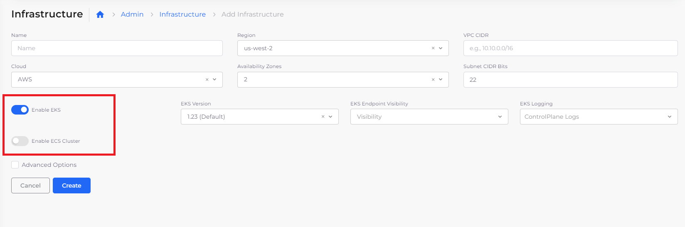

# Infrastructure and Plan

Infrastructures are abstractions that allow you to create a Virtual Private Cloud (VPC) instance in the DuploCloud Portal. When you create an Infrastructure, a Plan is automatically generated to supply the network configuration necessary for your Infrastructure to run.&#x20;


DuploCloud automatically deploys [NAT gateways](https://docs.aws.amazon.com/vpc/latest/userguide/vpc-nat-gateway.html) across availability zones (AZs) for all Infrastructures that you create with DuploCloud.


## Configuring EKS features (optional)

You can customize your EKS configuration:

* [Add VPC endpoints](add-vpc-endpoints.md).
* Enable EKS endpoints, logs, Cluster Autoscaler, and more. See the [EKS Setup](kubernetes-cluster/) topics for information about configuration options.

## Configuring ECS features (optional)

You can customize your ECS configuration. See the [ECS Setup](ecs-setup/) topic for information about configuration options.

## Creating an Infrastructure

When you create a DuploCloud Infrastructure, you create an isolated environment that maps to a Kubernetes cluster.&#x20;

Create a DuploCloud Infrastructure in the DuploCloud Portal:

1. Select **Administrator** -> **Infrastructure** from the navigation menu.&#x20;
2. Click **Add**.
3. Define the Infrastructure by completing the fields on the **Add Infrastructure** form.&#x20;
4. Select **Enable EKS** to enable EKS for the Infrastructure, or select Enable ECS Cluster to enable an ECS Cluster during Infrastructure creation.
5. Optionally, select **Advanced Options** to specify additional configurations (such as [**Public** and **Private CIDR** Endpoints](kubernetes-cluster/enable-eks-endpoints.md)).
6. Click **Create**. The Infrastructure is created and is listed on the **Infrastructure** page.

<figure><figcaption>
AWS <strong>Add Infrastructure</strong> page with highlighted <strong>Enable EKS</strong> and <strong>Enable ECS Cluster</strong> options
</figcaption></figure>

When you create the Infrastructure, DuploCloud creates the following components:

* VPC with 2 subnets (private, public) in each availability zone
* Required security groups
* NAT Gateway
* Internet Gateway
* Route tables
* [VPC peering](../../aws-services/virtual-private-cloud-vpc-peering.md) with the master VPC, which is initially configured in DuploCloud


Cloud providers limit the number of Infrastructures that can run in each region. Refer to your cloud provider for further guidelines on the number of Infrastructures you can create.


## Viewing Infrastructure settings

1. In the DuploCloud Portal, navigate to **Administrator** -> **Infrastructure**. The **Infrastructure** page displays.
2. From the **Name** column, select the Infrastructure containing settings that you want to view.
3. Click the **Settings** tab. The Infrastructure settings display.

<figure><figcaption>
<strong>Settings</strong> tab on the <strong>Infrastructure</strong> page
</figcaption></figure>

## Plans and Infrastructures

Once the Infrastructure is created, DuploCloud automatically creates a [Plan ](../../../welcome-to-duplocloud/application-focussed-interface/plan.md)(with the same Infrastructure name) with the Infrastructure configuration. The Plan is used to create [Tenants](../tenant-environment/).


Up to one instance (0 or 1) of an EKS or ECS is supported for each DuploCloud Infrastructure.

