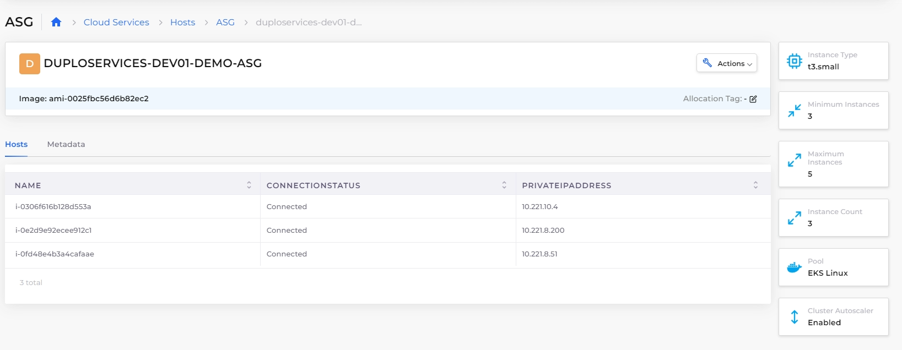

# Autoscaling Groups (ASG)

Configure Autoscaling Groups (ASG) to ensure the application load is scaled based on the number of EC2 instances configured. Autoscaling detects unhealthy instances and launches new EC2 instances. ASG is also cost-effective as EC2 Instances are dynamically created per the application requirement within minimum and maximum count limits.&#x20;

## Creating Autoscaling Groups (ASG)


The Use for Cluster Autoscaling option will not be available until you enable the [Cluster Autoscaler option in your Infrastructure](./#configuring-cluster-autoscaler-for-your-infrastructure).


1. In the DuploCloud Portal, navigate to **Cloud Services** -> **Hosts**.
2.  Select the **ASG** tab, and click **Add**. The **Add ASG**  displays.\

    
<figure><figcaption>
The <strong>Add ASG</strong> <strong>Basic Options</strong> in the DuploCloud Portal
</figcaption></figure>

3. In the **Friendly Name** field, enter the name of the ASG.
4. Select **Availability Zone** and **Instance Type**.
5. In the **Instance Count** field, enter the desired capacity for the Autoscaling group.
6. In the **Minimum Instances** field, enter the minimum number of instances. The Autoscaling group ensures that the total number of instances is always greater than or equal to the minimum number of instances.
7. In the **Maximum Instances** field, enter the maximum number of instances. The Autoscaling group ensures that the total number of instances is always less than or equal to the maximum number of instances.
8. Select **Use for Cluster Autoscaling**.
9.  Select **Advanced Options**. The advanced options display. \

    <figure><figcaption>
The <strong>Add ASG Advanced Options</strong> page in the DuploCloud Portal
</figcaption></figure>
10. Optionally, complete the following fields.
    * Specify an **Image ID**.&#x20;
    * **Agent Platform**: Select **Linux Docker/Native** to run a Docker service or select **EKS Linux** to run services using EKS. Fill in additional fields as needed for your ASG.&#x20;
    * **Disk Size**: Defines the storage capacity (in GiB) of the instance's root or attached EBS volumes.
    * **Key Pair Type**: Specifies the SSH key pair used for instance access, supporting none, existing, or new key pairs.
    * **Enable Block EBS Optimization**: Boosts the I/O performance of attached EBS volumes for high-throughput workloads.
    * **Enable Hibernation**: Preserves the instance's in-memory state to allow faster recovery from a hibernated state.
    * **Metadata Service**: Configures the AWS Instance Metadata Service, with IMDSv2 recommended for enhanced security.
    * Enable [**Spot Instances**](spot-instances.md), and enter a **Maximum Spot Price.**
    * Enable [**Scale from zero**](scale-to-or-from-zero.md) (EKS only).&#x20;
    * Select **Enabled Metrics**. This allows you to select which CloudWatch metrics will be collected and monitored for the ASG, providing greater control over performance and scaling insights. Available options include:&#x20;
      * **GroupMinSize**: Tracks the minimum size of the Auto Scaling Group.
      * **GroupMaxSize**: Tracks the maximum size of the Auto Scaling Group.
      * **GroupDesiredCapacity**: Monitors the desired number of instances in the Auto Scaling Group.
      * **GroupInServiceInstances**: Tracks the number of instances currently running and in service.
      * **GroupInServiceCapacity**: Monitors the total capacity of instances currently in service.
      * **GroupPendingInstances**: Tracks the number of instances that are in the process of launching.
    * Enter **Base64 Data**, **Volumes**, or **Tags**.
11. Click **Add**. Your ASG is added and displayed in the **ASG** tab.

## Viewing Hosts in Autoscaling Groups

To view the hosts in an Autoscaling group, follow these steps:

1. In the DuploCloud Portal, navigate to **Cloud Services** -> **Hosts**.
2. Select the **ASG** tab.
3. In the **NAME** column, select the ASG for which you want to view Hosts.
4. Select the **Hosts** tab. A list of individual Hosts displays.&#x20;

<figure><figcaption>
The <strong>Hosts</strong> tab on the <strong>ASG Details</strong> page
</figcaption></figure>

## **Creating an Amazon EC2 Autoscaling Policy**

Refer to AWS [Documentation](https://docs.aws.amazon.com/autoscaling/ec2/userguide/as-scale-based-on-demand.html#as-how-scaling-policies-work) for detailed steps on creating Scaling policies for the Autoscaling Group.

## **Creating Services using Autoscaling Groups**

The DuploCloud Portal provides the ability to configure Services based on the platforms **EKS Linux** and **Linux Docker/Native**.  Select the ASG based on the platform used when creating services and Autoscaling groups. Optionally, if you previously [enabled Spot Instances in the ASG](spot-instances.md#enabling-spot-instances-when-creating-autoscaling-groups), you can configure the Service to use Spot Instances by selecting **Tolerate spot instances**.&#x20;

.png>)

.png>)
