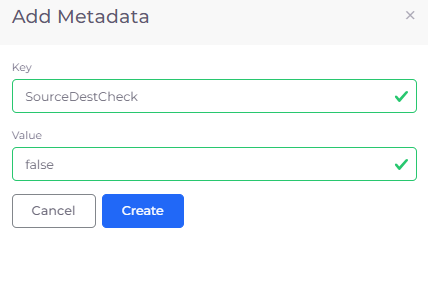
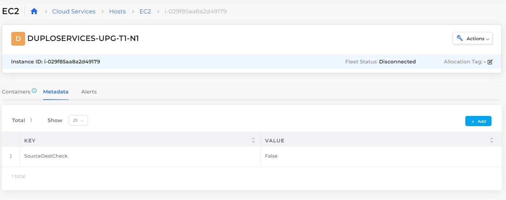

# Disable Source Destination Check


Source/destination checking is a security feature. Disabling it is only needed in specific use cases. In most cases, disabling it creates a security gap. We recommend consulting with the DuploCloud team before using this.


AWS EC2 ensures that each instance is either the source or the destination of any network traffic that it receives. This is called "[source/destination checking](https://docs.aws.amazon.com/AWSEC2/latest/UserGuide/using-eni.html#eni-basics)". In the DuploCloud Portal, this parameter is specified as `true`, by default, enabling source and destination checks.

There are times when you may want to override this default behavior, such as when an EC2 instance runs services [Network Address Translation (NAT)](https://docs.aws.amazon.com/vpc/latest/userguide/work-with-nat-instances.html#EIP_Disable_SrcDestCheck), routing, or firewalls. To override the default behavior and set the `SourceDestCheck` parameter to `false`, use this procedure.

## Disable `SourceDestCheck` in the DuploCloud Portal

Set `SourceDestCheck` to `false` for an EC2 Host:

1. In the DuploCloud Portal, navigate to **Cloud Services -> Hosts**.
2. In the **EC2** tab, select the Host for which you want to disable `SourceDestCheck`.
3. Click the **Metadata** tab.
4.  Click **Add**. The **Add Metadata** pane displays.\

    
<figure><figcaption>
<strong>Add Metadata</strong> pane for <strong>Key SourceDestCheck</strong>
</figcaption></figure>

5. In the **Key** field, enter **SourceDestCheck**.
6. In the **Value** field, enter **False**.
7. Click **Create**. The **Key**/**Value** pair is displayed in the **Metadata** tab.

<figure><figcaption>
<strong>EC2 Host</strong> page <strong>Metadata</strong> tab displaying <strong>SourceDestCheck Value</strong> of <strong>False</strong>
</figcaption></figure>
