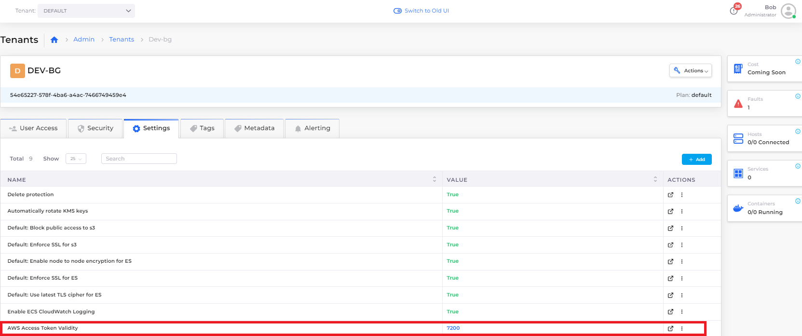

# JIT Access


Access the [AWS Console](using-aws-console.md) for specific resources created in DuploCloud, such as S3 Buckets and Dynamo databases, by clicking the **Console** link in the title bar of the resource page.


DuploCloud users can obtain Just-In-Time (JIT) access to the AWS Console. This access is restricted to resources that the user has access to in the DuploCloud portal. With JIT access, DuploCloud administrators have admin-level access within the AWS Console and the access is generated in real-time and revoked, by default, in one hour.

## Access using the UI

You can obtain AWS JIT access directly from the DuploCloud Portal, as well as obtain temporary AWS credentials to the Tenant, and access to AWS from your workstation.&#x20;

1. In the DuploCloud Portal, navigate to **Administrator** -> **User** and select the **Username** that needs access.
2.  In the upper-right corner of the Portal, click the user profile picture and select **Profile**. The **User Profile** page displays.\


    <figure><figcaption><p>User profile area of the DuploCloud Portal with the <strong>Profile</strong> option</p></figcaption></figure>
3.  From the **JIT AWS Console** list box, select the appropriate option to open the **JIT AWS Console**, get **Temporary AWS Credentials** to the Tenant, or obtain **AWS Access from my Workstation**. \


    <figure><figcaption><p>DuploCloud User <strong>Profile</strong> page with <strong>JIT AWS Console</strong> list box and available options</p></figcaption></figure>

### Accessing the JIT AWS Console from the UI

When you select **JIT AWS Console**, the AWS Console launches.

### Selecting temporary or permanent access to AWS Credentials

When you select Temporary AWS Credentials, the **Get JIT AWS Access** window displays with available links for **temporary** or **permanent** access, as in the graphic below. For temporary access, click **Get JIT Access**. For permanent access, click the **more permanent** link.

<figure><figcaption><p><strong>Get JIT AWS Access</strong> window with temporary and permanent options</p></figcaption></figure>

### Obtaining AWS access for a workstation

When you select **AWS Access from my Workstation**, the **Get JIT AWS Access** window displays with the **Access to AWS from your Workstation** option. Follow the instructions and links.

## Access the AWS Console using the CLI and `duplo-jit`

Obtain access through the command line interface (CLI) with `duplo-jit`. `duplo-jit` must obtain an AWS JIT session using a [DuploCloud API Token](https://docs.duplocloud.com/docs/administrator-tools/access-control/api-tokens). This token can be specified either as part of your local AWS configuration or can be obtained interactively, using your DuploCloud portal session.

### Install with Homebrew

Run the following command:&#x20;

```
brew install duplocloud/tap/duplo-jit
```

### Install from GitHub Releases

1. Download the latest **.zip** archive from [https://github.com/duplocloud/duplo-jit/releases](https://github.com/duplocloud/duplo-jit/releases) for your operating system.
2. Extract the archive listed in the table below based on the operating system and processor you are running.&#x20;
3. Add the path to `duplo-jit` to your `$PATH` environment variable.&#x20;

| Processor/Operating System  | Archive                |
| --------------------------- | ---------------------- |
| Intel macOS                 | **darwin\_amd64.zip**  |
| M1 macOS                    | **darwin\_arm64.zip**  |
| Windows                     | **windows\_amd64.zip** |

### Obtaining credentials&#x20;

Obtain credentials using a DuploCloud API Token or interactively.

#### Using an API Token

1. [Obtain a DuploCloud API Token](https://docs.duplocloud.com/docs/administrator-tools/access-control/api-tokens).
2. Edit the AWS Config file (**\~/.aws/config**) and add the following profile, as shown in the code snippet below:

```
[profile <ENV_NAME>]
region=us-west-2
credential_process=duplo-jit aws --admin --host https://<ENV_NAME>.duplocloud.net --token <DUPLO_TOKEN>
```

#### Obtain credentials interactively

To obtain credentials interactively, rather than with a token, replace `--token <DUPLO_TOKEN>` in the argument above with `--interactive`.

When you make the first AWS call, you are prompted to grant authorization through the DuploCloud portal, as shown below. Click **Authorize** if you consent.

<figure><figcaption><p><strong>Local Access Requested</strong> prompt</p></figcaption></figure>

Upon successful authorization, A Just-In-Time token is provided, which is valid for one hour. When the token expires, you are prompted to re-authorize the request.

## Accessing the AWS Console using the CLI

Obtain access to the AWS console using the Command Line Interface (CLI).

### **Accessing the AWS Console**

As long as you use the `AWS_PROFILE` that matches the profile name you set [in the section above](jit-access.md#obtaining-credentials), the AWS CLI obtains the required access credentials.

For example:

`AWS_PROFILE=<ENV_NAME> aws ec2 describe-instances`

### **Obtaining a link to the AWS Console URL**

To obtain a link to the AWS Console, run one of the following commands, which copies the Console URL to your clipboard that you can use in any browser.

All of these examples assume Administrator role access, passing the `--admin` flag. If you are obtaining JIT access for a User role (not Administrator), ensure that you replace the `--admin` argument in the following code snippets with `--tenant <YOUR_TENANT>`, for example `--tenant dev01`.  Tenants are lower-case at the CLI.


If you are receiving errors when attempting to retrieve credentials, try running the command with the `--no-cache` argument.


#### Using an API Token

```
duplo-jit aws --admin --host "https://<ENV_NAME>.duplocloud.net" --token <DUPLO_TOKEN> | jq -r .ConsoleUrl | pbcopy
```

#### Obtain a link interactively

```
duplo-jit aws --admin --host "https://<ENV_NAME>.duplocloud.net" --interactive | jq -r .ConsoleUrl | pbcopy
```

#### Obtain a link interactively in PowerShell

```
duplo-jit aws --admin --host "https://<ENV_NAME>.duplocloud.net" --interactive | ConvertFrom-Json | Select-Object -ExpandProperty ConsoleUrl | Set-Clipboard
```

#### Obtain a link by configuring your `zsh` shell

Add the following to your `.zshrc` file:

```
function jitnow() {
  duplo-jit aws --admin --no-cache --host "https://$1.duplocloud.net" --interactive | jq -r .ConsoleUrl | pbcopy
}
```


usage is `jitnow <ENV_NAME>`


## Configuring JIT session timeout

By default, JIT sessions expire after one hour. This can be modified in the DuploCloud Portal for a specific Tenant.&#x20;

1. In the DuploCloud Portal, navigate to **Administrator** -> **Tenant**.
2. Select the **Tenant** for which you want to change the expiration period from the **NAME** column.
3. Click the **Settings** tab.
4. Click **Add** to add a custom timeout setting. The **Add Tenant Feature** pane displays.
5. Select **AWS Access Token Validity** from the **Select Feature** list box.
6. In the field below (the value), specify the desired timeout period in seconds. in the example below, we specify **7200** seconds or two (2) hours, overriding the default of **3600** seconds, or one (1) hour.
7. Click **Update**. The new setting is displayed in the **Tenants, Settings** tab.

<div align="left">

<figure><figcaption><p><strong>Update Tenant Feature</strong> pane to specify new default timeout in seconds</p></figcaption></figure>

</div>

<figure><figcaption><p><strong>AWS Access Token Validity</strong> settings updated with a value of <strong>7200</strong> (seconds)</p></figcaption></figure>


If you are increasing the session timeout beyond the AWS default of 1 hour, you also need to update the maximum session duration value for the IAM role assigned to your DuploCloud tenant.&#x20;

Access the AWS Console as an Administrator using [the instructions above](jit-access.md#accessing-the-aws-console). In the AWS Console, navigate IAM -> Roles and modify the value for your tenant accordingly. For example, if your Tenant is named DEV01, and you need to set a timeout of two hours (7200 seconds), locate the IAM role **duploservices-dev01** and modify the **Maximum Session Duration** to two hours.


