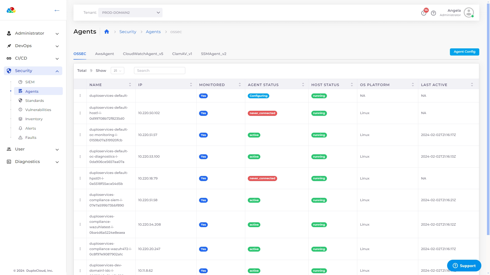

# Agents

## Viewing agents

To view running agents, navigate to **Security** -> **Agents** from the DuploCloud Portal.&#x20;

<div align="left">

<figure><figcaption><p>The <strong>Agents</strong> page on the DuploCloud Portal.</p></figcaption></figure>

</div>

## Excluding agents

You can exclude an agent from installing on all Hosts by default or configure an agent to only install on specified Tenants.&#x20;

### Excluding agents from all Hosts by default.&#x20;

1. From the DuploCloud Portal, navigate to **Security** -> **Agents**.&#x20;
2. Click **Agent Config**. The **Agent Config** YAML screen displays.
3. For the agent you want to exclude by default, set the **ExcludeAgentByDefault** flag value to **true**.
4.  Click **Update**. By default, the agent will not install/run on any Hosts. \


    <div align="left">

    <figure><figcaption><p>The <strong>Agent Config</strong> YAML screen with the Agent configured not to run by default.</p></figcaption></figure>

    </div>

### Configuring agents to install on specified Tenants

1. Follow steps 1-4 above for [Excluding Agents from all Hosts by default](agents.md#excluding-agents-from-all-hosts-by-default) to set the **ExcludeAgentByDefault** flag value to **true**.
2. From the DuploCloud Portal, navigate to **Security** -> **Agents**.&#x20;
3. Click **Agent Config**. The **Agent Config** YAML screen displays.
4. Paste the YAML (replacing the Tenant IDs with your Tenant IDs) in the **Agent Config** YAML screen as shown below.&#x20;
5. Click **Update**. The agent will not run on any Hosts except those associated with the Tenant IDs listed.&#x20;


```yaml
        "IncludeTenants": [
            "e722dfab-7a23-4838-80ec-b59ed5462ee6",
            "ca408e43-8fb0-46d1-8744-0530c22a8898:
        ]
```


<div align="left">

<figure><figcaption><p>The <strong>Agent Config</strong> YAML screen with the Agent configured to run only on the listed Tenants. </p></figcaption></figure>

</div>

## Supported agent settings

From the DuploCloud Portal, navigate to **Security** -> **Agents**. From the menu icon () to the left of an agent, you can perform the following actions:

| **View Agent Details** | View agent details in the **Agent Details** YAML screen.                                     |
| ---------------------- | -------------------------------------------------------------------------------------------- |
| **Repair Agent**       | Restore the functionality or integrity of the agent.                                         |
| **Exclude Host**       | Exclude the Host from monitoring.                                                            |
| **Force Exclude Host** | Exclude the Host from monitoring, overriding default or configured criteria, if applicable.  |

<div align="left">

<figure><figcaption><p>The supported actions for an agent on the <strong>Agent</strong> page. </p></figcaption></figure>

</div>


