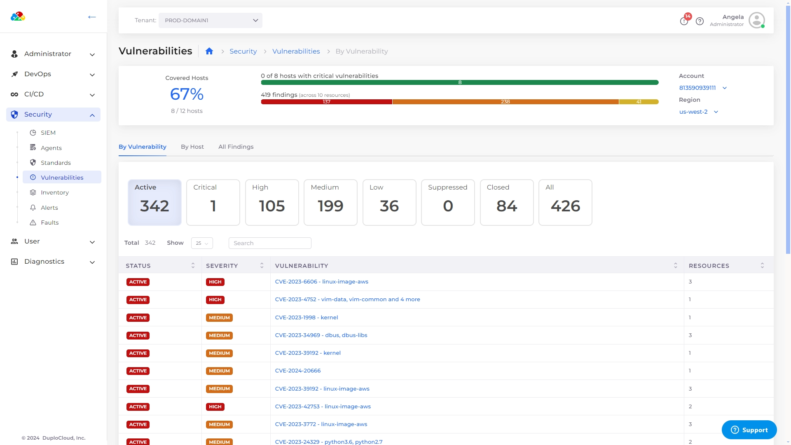

# Vulnerabilities

The **Vulnerabilities** dashboard gives you a summary of the cyber threats that can put your cloud installation at risk. Use the **Vulnerabilities** dashboard in the DuploCloud platform to view vulnerabilities by Host or severity level. AWS CloudWatch is used to monitor risks to your environment.&#x20;

From the DuploCloud Portal, navigate to **Security** -> **Vulnerabilities**. The **Vulnerabilities** page displays.&#x20;

<figure><figcaption>
The <strong>Vulnerabilities</strong> page in the DuploCloud platform.
</figcaption></figure>

