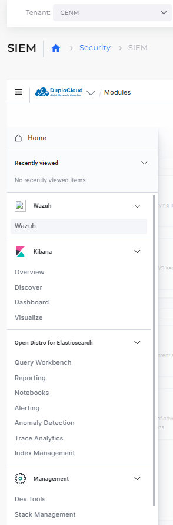
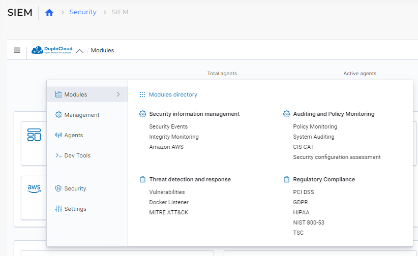

# SIEM

SIEM is a Cloud Solution that provides cloud customers with visibility into their infrastructure and applications, to facilitate data-driven decisions. SIEM monitors workloads in real-time, identify security issues, provide virus and malware protection, and expedite root-cause analysis.

You can monitor and manage your Cloud account using SIEM in the DuploCloud Portal.

## Configuring the DuploCloud Portal to access SIEM

To connect your  SIEM with the DuploCloud Portal, contact our DuploCloud Support Team using your DuploCloud Slack channel or email the team.

## Using the SIEM Dashboard

After DuploCloud has connected your SIEM account to the DuploCloud Portal, you'll have full access to your SIEM modules without having to log in to the Cloud Portal. You can open multiple dashboard instances by clicking **Open New Tab** on the SIEM page.

The SIEM dashboard displays modules, grouped by the following categories:

* **Security Information Management** - Investigate Security Events and Alerts related to Cloud services.
* **Auditing and Policy Monitoring** - Examine security policies and auditing reports. Scan your assets and work with Configuration Assessment reports that audit your environment.
* **Threat Detection and Response** - Analyze data about cyber threats, vulnerabilities, and security attack strategies identified by the **MITRE ATT\&CK** database.
* **Regulatory Compliance** - Gather comprehensive details about all of your regulatory and compliance controls and how well your installation is measuring up. Detailed statistics covering your compliance with **PSI**, **TSC**, **HIPAA**, **NIST 800-53**, and **GDPR** regulations are available in one place.

<figure><figcaption>
<strong>SIEM</strong> page with available <strong>Modules</strong> and <strong>Open New Tab</strong> option
</figcaption></figure>

## Using the Navigation Menu

Clicking the Navigation Menu icon (  ) allows you to access a number of integrated tools that DuploCloud has plugged into the portal such as Wazuh, Kibana, and Open Distro for ElasticSearch, which connect you to the SIEM application in the Cloud. You also can use Management functions such as Dev Tools, to access the SIEM console for creating queries and the Stack Management function in Kibana.&#x20;

<figure><figcaption>
Navigation Menu icon on the <strong>SIEM</strong> page
</figcaption></figure>

## Using the DuploCloud Modules window menu

The DuploCloud **Modules** window menu gives you centralized access to available SIEM modules with the **Modules directory** but also lets you navigate to other options as well.

<figure><figcaption>
DuploCloud <strong>Modules</strong> window with <strong>Modules directory</strong> on the <strong>SIEM</strong> page
</figcaption></figure>

### Management directory

<figure><figcaption>
<strong>Management directory</strong> featuring <strong>Administration</strong> and <strong>Status and reports</strong> menus
</figcaption></figure>

The **Management directory** includes a number of tools for **Administration**, including the **Rules** page, displayed below, and **Status and Reports**. You can also manage your **Security** and general **Settings** from the DuploCloud **Modules** window.

<figure><figcaption>
<strong>Rules</strong> page from <strong>Management directory Administration</strong> <strong>-> Rules</strong> option
</figcaption></figure>

### Agents&#x20;

The **Agents** option allows you to view a dashboard of all running agents from AWS and DuploCloud.&#x20;

<figure><figcaption>
<strong>Agents</strong> dashboard
</figcaption></figure>

### Dev Tools

**Dev Tools** gives you direct access to the AWS Console.&#x20;

<figure><figcaption>
AWS Console from the <strong>Dev Tools</strong> option
</figcaption></figure>
