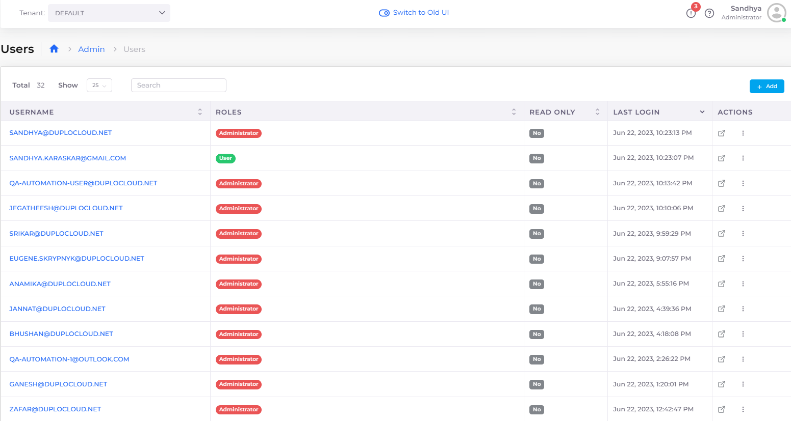
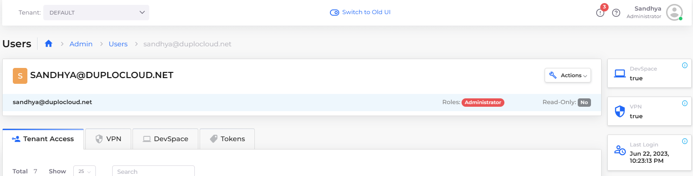

# User access to DuploCloud


You need to be an **Administrator** to add, edit, or delete permissions.


## Add a new user

Add a new user and give them appropriate permissions:&#x20;

1. In the DuploCloud Portal, navigate to **Administrator** -> **Users**.&#x20;
2.  Click **Add**. The **Create User** pane displays.\

    

    <figure><figcaption>
<strong>Create User</strong> pane
</figcaption></figure>

    

3. Define a **Username**, select a **Role**, and **Provision VPN** access and **Read Only Access**, if required.
4. Click **Submit**.

## Edit permissions for an existing user

Edit an existing user's permissions and role:

1. In the DuploCloud Portal, navigate to **Administrator** -> **Users**.&#x20;
2. From the **Username** column, select the user whose permissions you want to modify. The user's page displays.
3. Click the **Actions** menu and select **Update**.&#x20;
4. Modify the user permissions.
5. Click **Submit**.&#x20;

## View users

View users and their permissions:

1.  In the DuploCloud Portal, navigate to **Administrator** -> **Users**. The **Users** page displays.\

    <figure><figcaption>
DuploCloud <strong>Users</strong> page
</figcaption></figure>
2.  From the **Username** column, select the user that you want to view. The user's page displays tabs with more information about [**Tenant Access**](tenant-access/), [**VPN** access](add-and-delete-vpn-access-for-users.md), and API [**Tokens**](api-tokens.md).\

    <figure><figcaption>
User page with <strong>Tenant Access</strong>, <strong>VPN</strong>, <strong>DevSpace</strong>, and <strong>Token</strong> tabs; <strong>Last Login</strong> card
</figcaption></figure>


Use the **Last Login** card for the date and time of the user's last log-in.


## Enable inactive user notification

Configure the system to generate faults when a user has been inactive or has not logged in for a period of time.

1. From the DuploCloud portal, navigate to **Administrator** -> **Systems Settings**. Select the **Config** tab, and click **Add.**&#x20;
2. For **Config Type** select **App Config**, for **Key**, select **Enable Inactive User Notification**, and in the **Value** field, enter the **number of days** of inactivity that should generate a fault.&#x20;

<figure><figcaption>
The <strong>Add Config</strong> pane configured to generate faults when a user has been inactive for 100 days. 
</figcaption></figure>

1. Click **Submit**. DuploCloud will generate a fault when a user has been inactive or has not logged in in the set number of days.

## Delete an existing user

Delete an existing user and their permissions:

1. In the DuploCloud Portal, navigate to **Administrator** -> **Users**.&#x20;
2. From the **Username** column, select the user that you want to delete. The user's page displays.
3. Click the **Actions** menu and select **Delete**.&#x20;
4. Review the confirmation message and click **Confirm** to permanently delete the user.

