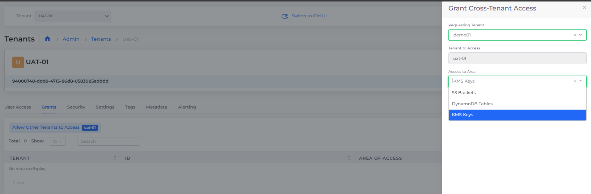

# Cross-tenant Access


These features are currently only available for AWS.


You can configure the DuploCloud Portal to support various types of _Cross-tenant access_. Cross-tenant access enables you to share access to resources and services between two DuploCloud [Tenants](../../../getting-started/application-focussed-interface/tenant.md).

Configure Cross-tenant access to:

* [Grant a Tenant full access to another Tenant in the DuploCloud Portal](cross-tenant-access.md#granting-full-cross-tenant-access-between-tenants).
* [Share specific services between Tenants in the DuploCloud Portal](cross-tenant-access.md#granting-cross-tenant-access-to-specific-iam-restricted-services) that are restricted by IAM policies.

## Granting general non-IAM restricted access between Tenants

When you grant general non-IAM restricted access between Tenants, you allow one DuploCloud  Tenant full access to another Tenant's workspace or Namespace. Restrictions are defined by your Security Groups in your underlying Cloud Platform. In the DuploCloud Portal, you configure general access between Tenants using a Tenant's **Security** tab.

To grant Cross-tenant access only to specific services that are restricted by IAM policies, see [the next section](cross-tenant-access.md#granting-cross-tenant-access-to-specific-iam-restricted-services).

1. In the DuploCloud Portal, navigate to **Administrator** -> **Tenants**.
2. Select the Tenant whose resources you want to share from the **Name** column.
3. Click the **Security** tab.
4. Click **Add**. The **Add Tenant Security** pane displays.
5. From the **Source Type** list box, select **Tenant**.
6. From the **Tenants** list box, select another Tenant with whom you want to share resources.
7. From the **Protocol** list box, select the protocol that you want to use for sharing.
8. In the **Port Range** field, specify the range of ports to which you want to grant access.
9. Add a user-friendly **Description** of this sharing rule.
10. Click **Add**.

<figure><figcaption>
<strong>Add Tenant Security</strong> pane
</figcaption></figure>

## Granting Cross-tenant access to specific IAM-restricted services

To allow access, or create a share, between two Tenants for specific IAM-restricted services, perform this procedure using the Tenant **Grants** tab.&#x20;

To establish general non-IAM restricted Cross-tenant access, see [the previous section](cross-tenant-access.md#granting-general-non-iam-restricted-access-between-tenants).&#x20;

You can share access to the following Services between Tenants:

* S3 Buckets
* DynamoDB Tables
* KMS Keys


Ensure that the two Tenants that are sharing resources reside within the same region in the AWS Portal.


1. In the DuploCloud portal, navigate to **Administrator** -> **Tenants**. The **Tenants** page displays.
2. From the **Name** column, select the Tenant with access to the restricted resource that you want to share. In this example, we choose to share resources to which Tenant **uat-01** has access.
3.  Click the **Grants** tab. Select **Allow Other Tenants to access **_**TENANT\_NAME**_, where _**TENANT\_NAME**_ is the Tenant you selected.\

    

    <figure><figcaption>
<strong>Grants</strong> tab with <strong>Allow Other Tenants to access </strong><em><strong>TENANT_NAME</strong></em> option 
</figcaption></figure>

    

4.  Click **Add**. The **Grant Cross-Tenant Access** pane displays.\

    

    <figure><figcaption>
<strong>Grant Cross-Tenant Access</strong> pane
</figcaption></figure>

    

5. From the **Requesting Tenant** list box, select the Tenant with whom you want to share access. In this example, the **Requesting Tenant** is **demo01**.
6. From the **Access to Area** list box, select the restricted policy-based resource that you want to share.
7. Click **Create**. Your Cross-tenant Access share is created.

### Viewing Cross-tenant grants to restricted policy-based resources

1. In the DuploCloud portal, navigate to **Administrator** -> **Tenants**. The **Tenants** page displays.
2. From the **Name** column, select the Tenant whose Cross-tenant grants you want to view. In this example, we select Tenant **uat-01**.
3. Click the **Grants** tab. Select **Allow Other Tenants to access **_**TENANT\_NAME**_, where _**TENANT\_NAME**_ is the Tenant you selected.
4. The resources that _**TENANT\_NAME**_ (**uat-01**, in this example) has access to are displayed.

<figure><figcaption>
<strong>Grant</strong> tab on the <strong>Tenant</strong> page
</figcaption></figure>

