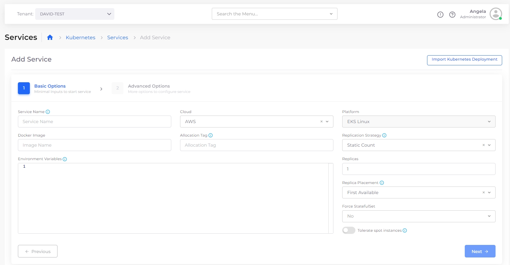
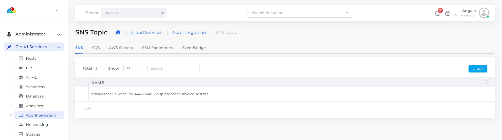

# Services

A Service could be a Kubernetes Deployment, StatefulSet, or DaemonSet. It can also be a Lambda function or an ECS task or service, capturing a microservice. Each service (except Lambda) is given a load balancer to expose itself and assigned a DNS name.


DuploCloud Service should not be confused with a Kubernetes or ECS service. By service, we mean application components that can be either Docker-based or serverless.


For information on cloud-specific Services supported by DuploCloud, see:

* [AWS Services](../../../overview/aws-services/)
* [Azure Services](../../../overview-2/azure-services/)
* [GCP Services](../../../overview-1/gcp-services/)

Below is an image of some properties of a service:

<figure><figcaption></figcaption></figure>

**Cloud Services:** DuploCloud supports a simple application-specific interface to configure dozens of cloud services, such as S3, SNS, SQS, Kafka, Elasticsearch, Data Pipeline, EMR, Sagemaker, Azure Redis, Azure SQL, Google Redis, etc. Almost all commonly used services are supported, and new ones are constantly added. A typical request to support a new service takes the DuploCloud team a matter of days, depending on the complexity of the service.


While users specify application-level constructs for provisioning cloud resources, DuploCloud implicitly adds all the underlying DevOps and compliance controls.


<figure><figcaption></figcaption></figure>


**IMPORTANT:** All services and cloud features are created within a [Tenant](tenant.md).

