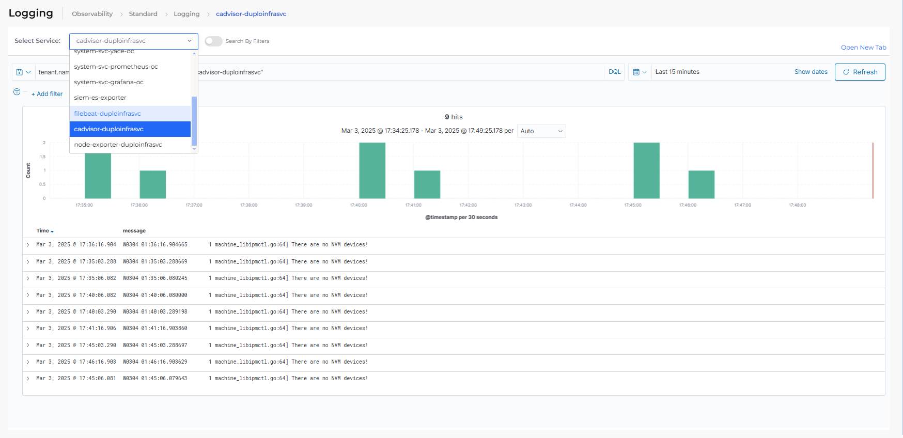

# Diagnostics

## DuploCloud Diagnostics Functions

The DuploCloud platform automatically orchestrates the following main diagnostic functions:

### **Central Logging**

A shared Elasticsearch cluster is deployed and Filebeat is installed in all worker nodes to fetch logs from various applications across Tenants. The logs are injected with metadata corresponding to the Tenant, Service, container ID, Host, etc. Further, each Tenant has a central logging dashboard which includes the Kibana view of logs from applications within the Service. See the screenshot below:

<figure><figcaption>
The <strong>Logging</strong> dashboard in the DuploCloud Portal
</figcaption></figure>

### **Metrics**

Metrics are fetched from Hosts, containers, and Services and displayed in Grafana. Services metrics are collected behind the scenes by calling cloud provider APIs like CloudWatch and Azure Monitor. For nodes and containers, metrics are collected using Prometheus, Node Exporter, and cAdvisor. The Metrics dashboards are Tenant-centric and segregated per application and Service as shown in the image below:

<figure><figcaption>
The <strong>Metrics</strong> dashboard in the DuploCloud Portal
</figcaption></figure>

### **Alarms and Faults**

The platform creates faults for many failures automatically. For example, health check failures, container crashes, node crashes, deployment failures, etc. Further, users can easily set alarms like CPU and memory for EC2 instances or free disk space for RDS databases. Failures are displayed as faults under their respective Tenant. Sentry and Pager Duty projects can be linked to Tenants, and DuploCloud will send faults there so the user can set notification configurations.

### **Audit Trail**

All system changes are logged in an audit trail in Elasticsearch where they can be sorted and viewed by Tenant, Service, change type, user, and dozens of other filters.

<figure><figcaption>
The <strong>Audit</strong> dashboard in the DuploCloud Portal
</figcaption></figure>
