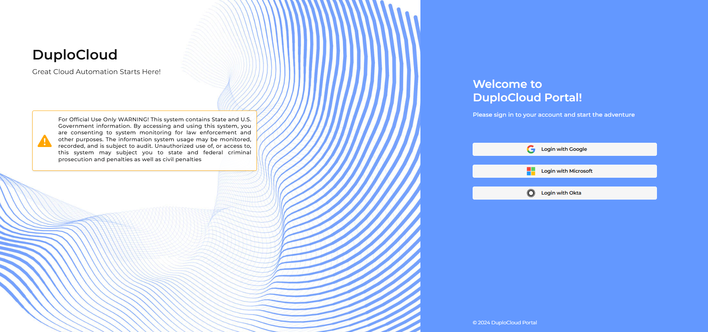

# 1. Log in to the DuploCloud Portal

Using the user ID and URL provided by the workshop instructor, log in to the DuploCloud Portal using SSO with Microsoft or Google.

<figure><figcaption>
The login screen for the DuploCloud Portal
</figcaption></figure>
