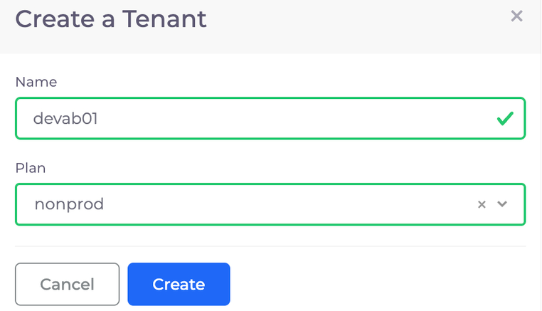
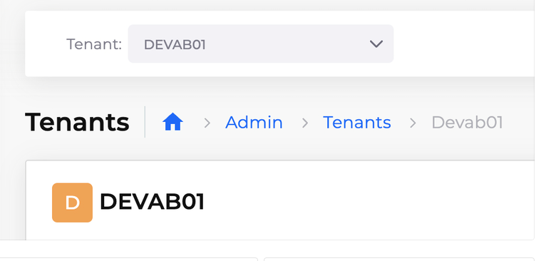

# 3. Create a DuploCloud Tenant

To create a Tenant, navigate to **Administrator** -> **Tenants**, and click **Add**. The **Create a Tenant** pane displays. Add the following details:

* **Name**: `dev`_\[YOUR\_INITIALS]_`01` (For example, `devab01`)
* **Plan**: `non-prod` (Specifying the Plan associates the new Tenant with the Infrastructure you created earlier)

Click **Create**.

<figure><figcaption>
The <strong>Create a Tenant</strong> pane
</figcaption></figure>

This takes around two (2) minutes. You may see a generated fault in **Administrator** -> **Faults** or the exclamation icon (**!**) displayed in the top right during provisioning.

Once it’s ready, select your new Tenant using the **Tenant** list box at the top of the screen.

<figure><figcaption>
The <strong>Tenant</strong> list box
</figcaption></figure>

