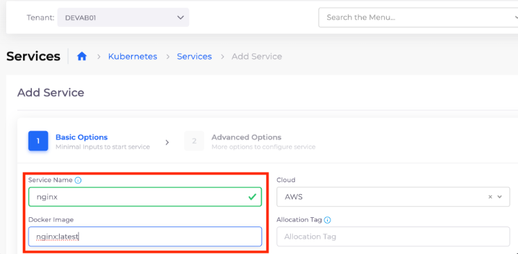

# 5. Deploy an Application

Navigate to **Kubernetes** -> **Services**, and click **Add**. The **Add Service** page displays. Enter the following details:

* **Name**: `nginx`&#x20;
* **Docker image**: `nginx:latest` (this is a sample public image)

<figure><figcaption>
The <strong>Add Service</strong> page
</figcaption></figure>

Click **Next**, and then click **Create**.
