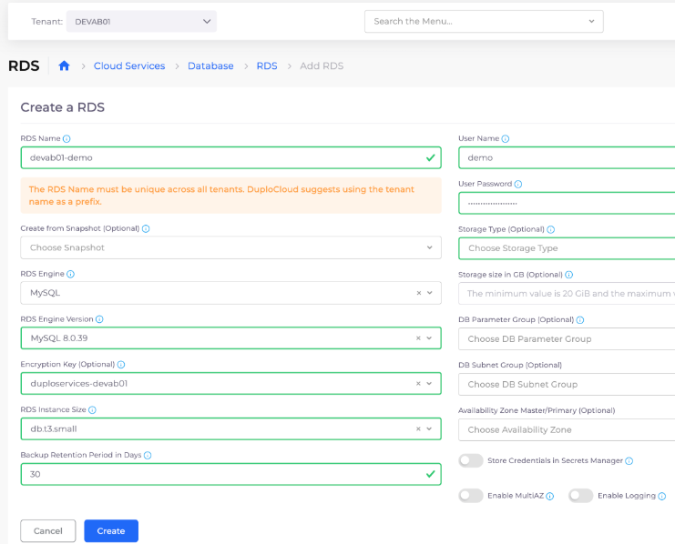

# 9. Deploy a Database

Navigate to **Cloud Services** -> **Database** -> **RDS**, and click **Add**. The **Create a RDS** page displays. Complete the fields with the following details:

* **Name**: \[_add_ `-demo` _to the name DuploCloud pre-populates_]&#x20;
* **RDS Engine Versio**n: `MySQL 8.0.39`&#x20;
* **RDS instance size**: `db.t3.small`&#x20;
* **User name**: `demo`&#x20;
* **User password**: `W5i6Uv6LQtyApVyJDrAq`

Click **Create**.

<figure><figcaption>
The <strong>Create a RD</strong>S page
</figcaption></figure>
