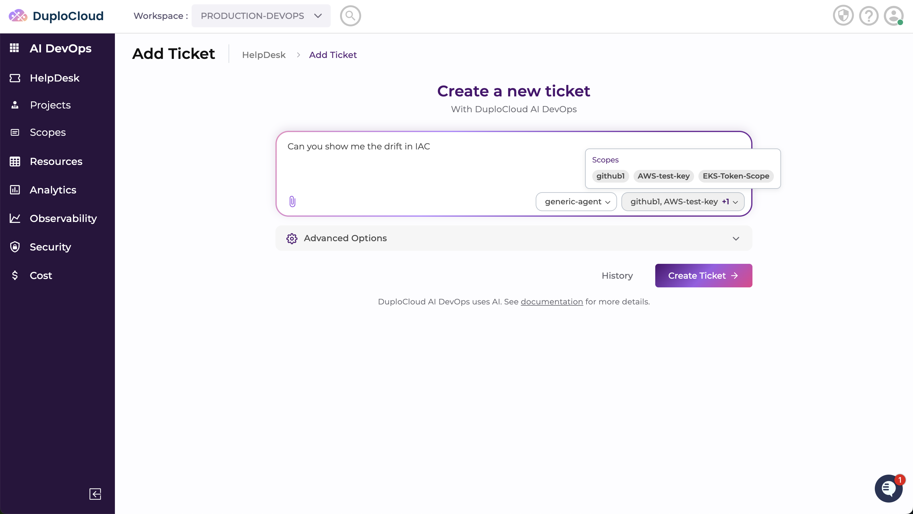
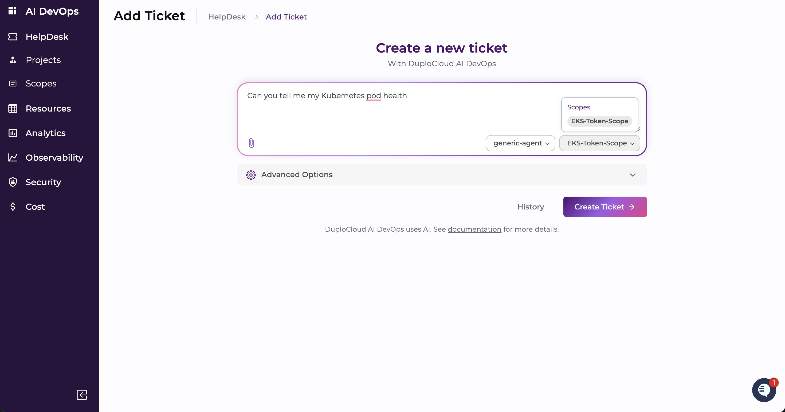
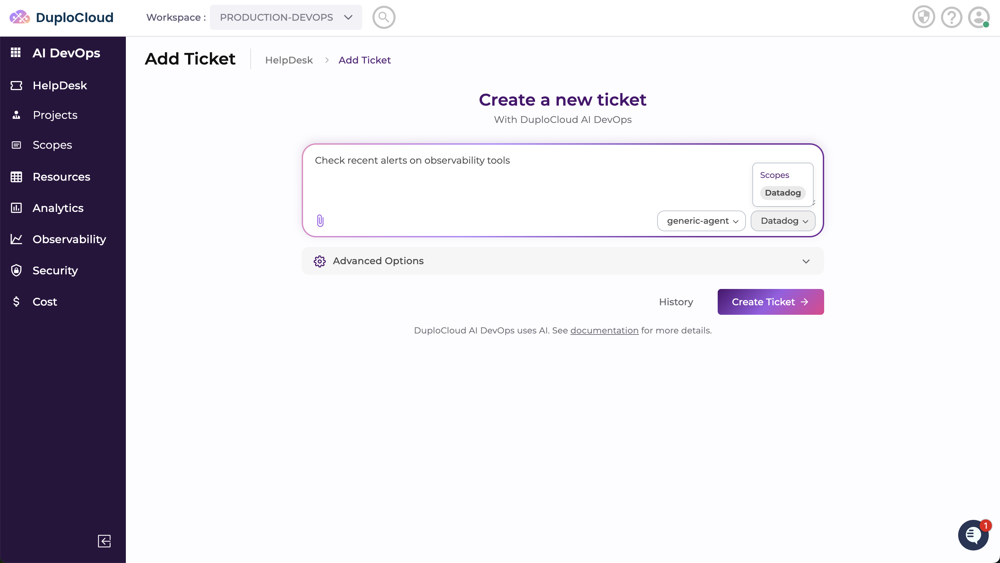
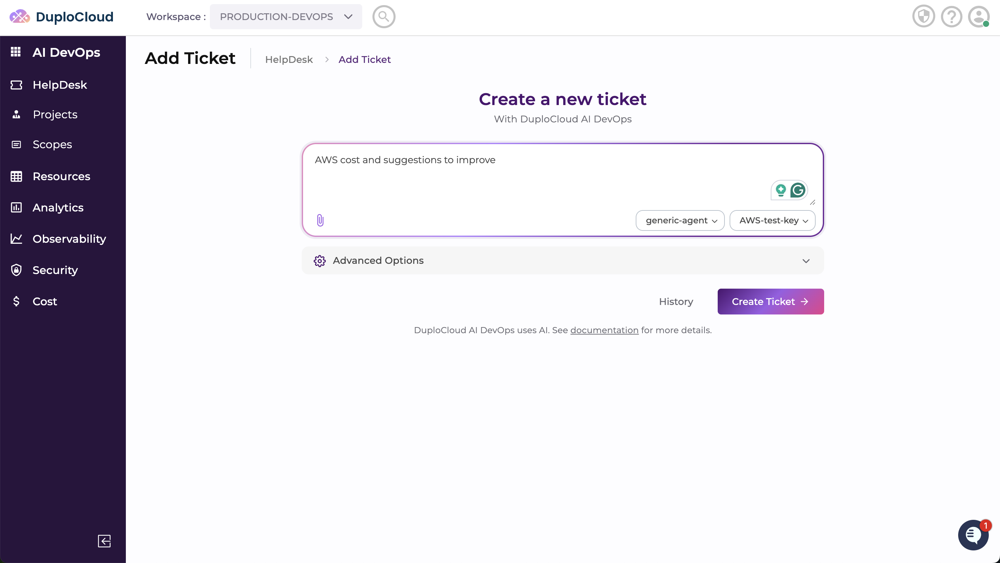

# 1. AI Suite

You can use DuploCloud's DevOps Agent to troubleshoot issues with your infrastructure, get guidance on common operational tasks, and receive suggested commands for Services, Containers, and cloud resources — all from within the DuploCloud Portal.

## Using the AI HelpDesk

Quickly interact with the DevOps Agent to get guidance, suggestions, or commands for common operational tasks.

Navigate to **HelpDesk** in the DuploCloud Portal and click **Add Ticket**. Select the **Scope** that gives the agent access to the infrastructure relevant to your task, and choose the **Personas** that equip it with the right skills. Then enter your request in the message field and click **Submit**.

The agent streams its response in real time. As it works, it may propose commands for you to **Approve**, **Reject**, **Ignore**, or **Execute** — no action is applied to your infrastructure without your sign-off.

## Daily Use Cases

The following are common operational tasks to try in the HelpDesk. For each, select a scope that covers the relevant environment and include the personas that match the task domain.

### Drift in IaC

* **Scope:** A scope with access to your Git repository and AWS account
* **Personas:** Terraform or IaC
*   **Message to Agent:**

    ```
    Review our Terraform state and compare it against what's currently provisioned
    in AWS. Identify any resources that exist in AWS but are not tracked in state,
    or resources in state that no longer exist. Summarise the drift and suggest
    remediation steps.
    ```

<figure><figcaption></figcaption></figure>

### Kubernetes Pod Health

* **Scope:** A scope with access to your Kubernetes cluster
* **Personas:** DevOps or Kubernetes
*   **Message to Agent:**

    ```
    Check the health of all pods across our Kubernetes cluster. Identify any pods
    in CrashLoopBackOff, Pending, or OOMKilled state. For each unhealthy pod,
    provide the relevant logs and a suggested fix.
    ```

<figure><figcaption></figcaption></figure>

### Recent Alerts on Observability Tools

* **Scope:** A scope that includes your observability provider or a configured MCP server for that tool
* **Personas:** DevOps
*   **Message to Agent:**

    ```
    Pull the most recent alerts from our observability platform from the last
    24 hours. Group them by severity and service. Highlight any that are still
    active and suggest next steps for the top three by impact.
    ```

<figure><figcaption></figcaption></figure>

### AWS Cost and Optimisation Suggestions

* **Scope:** A scope with read access to your AWS account
* **Personas:** DevOps or cost optimisation
*   **Message to Agent:**

    ```
    Analyse our AWS environment for cost inefficiencies. Look for oversized or
    idle EC2 instances, unattached EBS volumes, unused Elastic IPs, and any other
    common cost drivers. Provide a ranked list of recommendations with estimated
    monthly savings for each.
    ```

<figure><figcaption></figcaption></figure>
