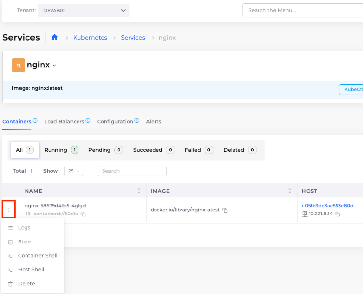
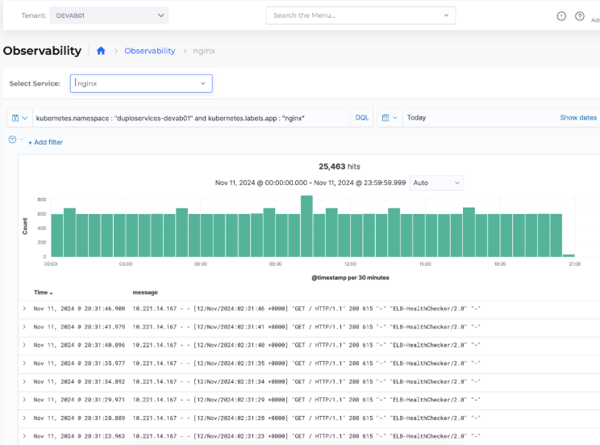

# 2. Logging

## Enabling Log Collection for Tenant

Navigate to **Administrator** -> **Observability**  -> **Standard** -> **Settings**, and select the **Logging** ta&#x62;**.** Select the Tenant for which you want to enable logging and click **Update**.

## Viewing Container Logs

Navigate to **Kubernetes** -> **Services**, and select the `nginx` Service.

In the **Containers** tab, click the menu icon (  ) next to the `nginx` container, and select **Logs**.

<figure><figcaption>
The <strong>Containers</strong> tab for <code>nginx</code> Service with the <strong>Logs</strong> option highlighted
</figcaption></figure>

## View Logging with OpenSearch

Navigate to **Observability** -> **Standard** -> **Logging.**

Logs are segregated by Tenant and then by Service.

<figure><figcaption>
Logging for the <code>nginx</code> Service on the <strong>Observability</strong> page
</figcaption></figure>
