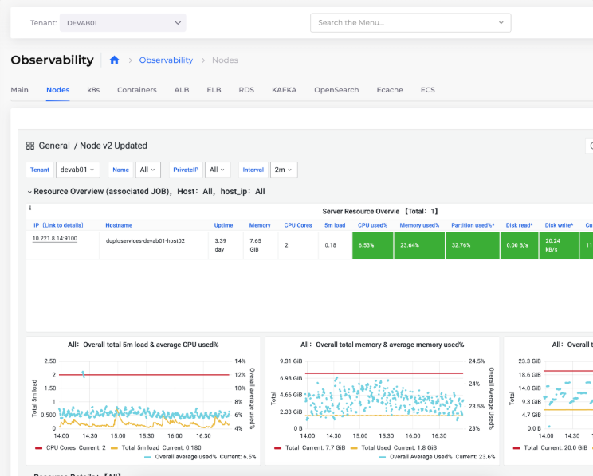

# 3. Metrics

## Enabling Metric Collection for Tenants&#x20;

Navigate to **Administrator** -> **Observability** -> **Standard** -> **Settings**, and select the **Monitoring** tab.

Select the Tenant for which you want to enable metrics, and click **Update**.

## Viewing Metrics

Navigate to **Observability** -> **Standard** -> **Metrics**.

<figure><figcaption>
The Metrics data for <strong>Nodes</strong>
</figcaption></figure>
