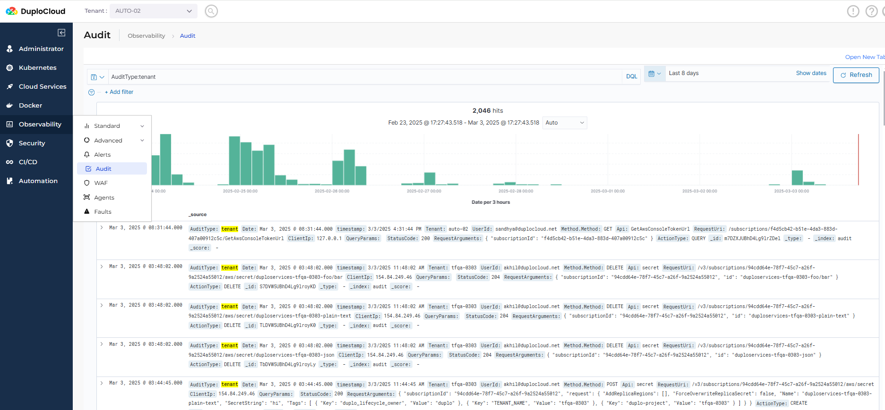

# 4. Audit Logs

1. Navigate to the **Audit** page using one of the following paths:
   * **Administrator** → **Observability** → **Audit**
   * **Observability** → **Audit**

<figure><figcaption>
The <strong>Audit</strong> page
</figcaption></figure>

Here is an example of the details of an audit event.

<figure><figcaption>
<strong>Audit</strong> event details
</figcaption></figure>

