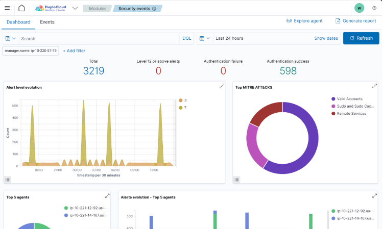
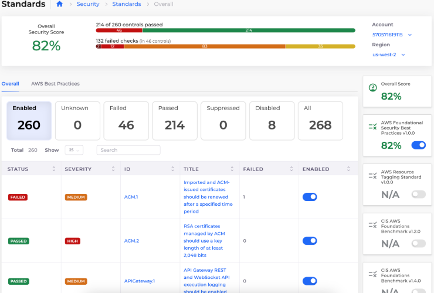

# 8. Security Hub and Dashboard

## SIEM

Navigate to **Security** -> **SIEM**.

<figure><figcaption>
The <strong>SIEM</strong> Dashboard in DuploCloud
</figcaption></figure>

## Security Dashboard

Navigate to **Security** -> **Standards**.

<figure><figcaption>
The <strong>Standards</strong> Dashboard in DuploCloud
</figcaption></figure>
