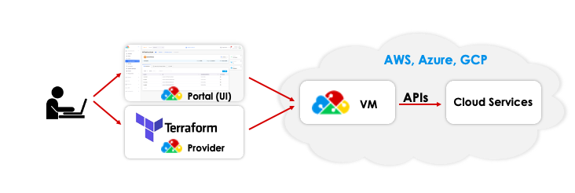

# 9. Terraform Mode of Operations

Here is a [sample Reference Architecture](https://github.com/aws-samples/aws-saas-factory-duplo-cloud-reference-architecture) that uses the DuploCloud Terraform Provider.

<figure><figcaption>
The DuploCloud Terraform Provider
</figcaption></figure>

[DuploCloud Terraform can be generated](https://github.com/duplocloud/tenant-terraform-generator) from existing DuploCloud Tenants.
